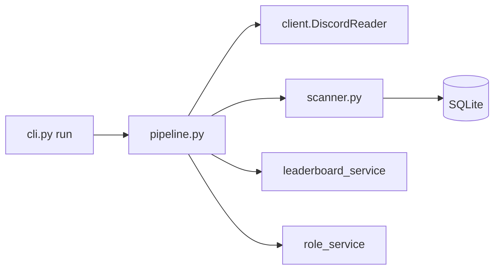
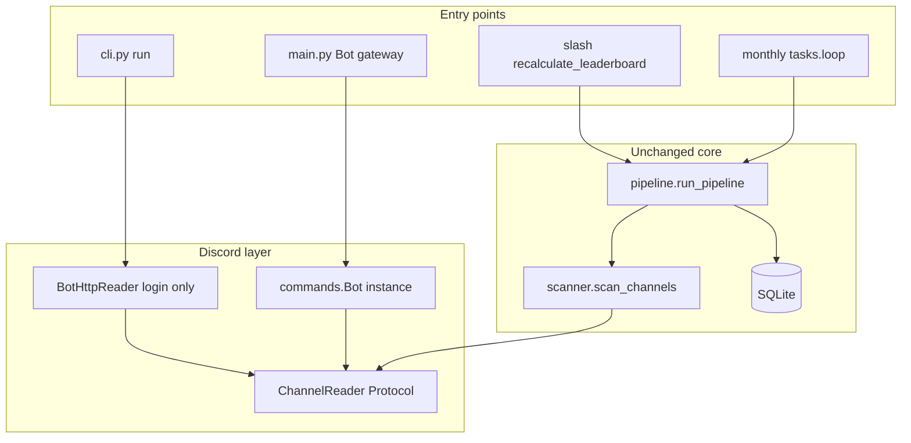
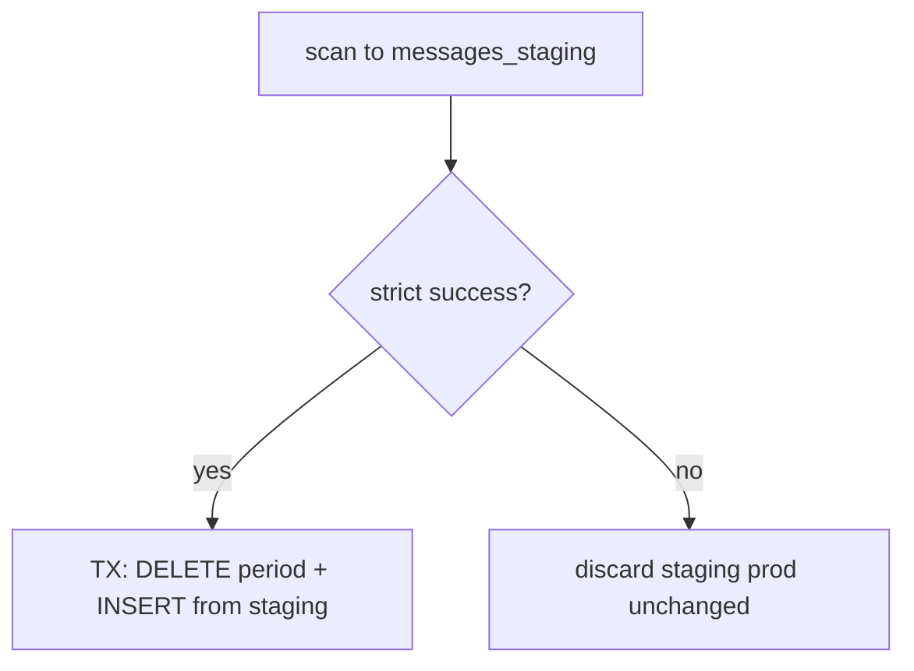
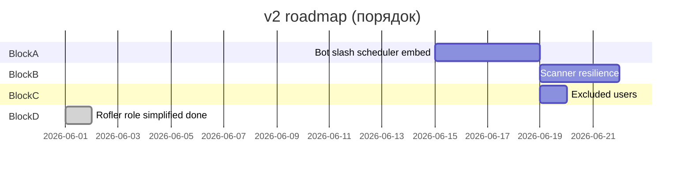

# План v2: Discord Reaction Leaderboard Bot

Документ для планирования доработок поверх **текущего v1 (CLI + user token)**.  
Опирается на фактическую структуру репозитория на момент составления.

---

## 1. Текущее состояние (v1) — карта кода

### Точки входа

| Файл | Назначение |
|------|------------|
| [`bot/cli.py`](../bot/cli.py) | `run`, `verify`, `messages`, `channels-top` |
| [`bot/pipeline.py`](../bot/pipeline.py) | Оркестратор: scan → commit → leaderboard → опционально Rofler roles |

### Discord (только чтение)

| Файл | Назначение |
|------|------------|
| [`bot/client.py`](../bot/client.py) | `DiscordReader` — `discord.py-self`, `login()` без gateway, `fetch_channel`, **нет** bot intents |
| [`bot/services/scanner.py`](../bot/services/scanner.py) | `channel.history`, фильтр `:EBALO:`, batch upsert |

**Зависимость:** `discord.py-self` в [`requirements.txt`](../requirements.txt) — заменить на `discord.py` в v2.

### Данные и отчёты

| Файл | Назначение |
|------|------------|
| [`bot/database/schema.sql`](../bot/database/schema.sql) | Таблица `messages` |
| [`bot/database/db.py`](../bot/database/db.py) | purge, upsert, leaderboard SQL, audit, per-channel TOP |
| [`bot/services/leaderboard_service.py`](../bot/services/leaderboard_service.py) | Агрегация по `author_id` (вся гильдия) |
| [`bot/services/channel_top_service.py`](../bot/services/channel_top_service.py) | TOP по `channel_id` |
| [`bot/services/user_messages_service.py`](../bot/services/user_messages_service.py) | Сообщения автора + ссылки |

### Заглушки / устаревшее в §1

| Файл | Статус (на момент v2) |
|------|------------------------|
| [`bot/services/role_service.py`](../bot/services/role_service.py) | **Реализован** упрощённый блок D — см. §6.1 |
| [`bot/config.py`](../bot/config.py) | v2: `DISCORD_BOT_TOKEN`, `ROLE_*`, `EXCLUDED_USER_IDS` |
| Gateway, slash, scheduler, embed | Реализованы в v2.0 (блок A) |

### Поток v1 (сохранить логику данных)



**Что уже можно переиспользовать в v2 без переписывания:**  
`dates.py`, `db.py` (+ schema), `leaderboard_service`, `channel_top_service`, `verify` / `messages` / `channels-top` (offline из SQLite).

**Что заменить/расширить:** `client.py`, `config.py`, `pipeline.py`, `role_service.py`, `requirements.txt`, точка входа (`main.py` + cog).

---

## 2. Цели v2 (ваши пункты)

| # | Цель | Кратко |
|---|------|--------|
| A | Полноценный бот | Bot token, `main.py`, slash, monthly job, embed — **детальный план: §3.7** (первый этап) |
| B | Устойчивый scan | Rate limits, resume, прогресс, не падать целиком |
| C | Исключения пользователей | Список `user_id`, не попадают в leaderboard и роли |
| D | Авто-роли | Правила вида «топ 3 с канала A, топ 2 с канала B» (TBD) |
| — | Просмотр данных | SQLite — источник истины; `/show_leaderboard`, CLI `verify` / `messages` / `channels-top` |

**Дальше (идеи):** полный рейтинг/детали в Discord (пагинация, TOP по каналу, сообщения автора) — те же SQL, что у CLI `verify` / `channels-top` / `messages`; Google Sheets — отдельный export-бэкенд, если понадобится.

---

## 3. Блок A — переход на полноценного бота

### 3.1. Конфиг

**Сейчас** ([`config.py`](../bot/config.py)):

- `DISCORD_USER_TOKEN` — required  
- `GUILD_ID`, `STATS_CHANNEL_IDS`, `LEADERBOARD_EMOJI`, TZ, paths  

**v2:**

```env
# Файл .env в корне (не коммитить; скопировать из .env.example)
DISCORD_BOT_TOKEN=          # обязательно: Bot Token из Developer Portal
GUILD_ID=
STATS_CHANNEL_IDS=
# ... остальное без изменений ...

LEADERBOARD_CHANNEL_ID=     # embed / уведомления о завершении job
MANUAL_RECALC_ROLE_ID=       # кто может /recalculate (опционально)
```

- Токен **только** из `.env`, загрузка через `python-dotenv` в `get_settings()` — не в коде и не в аргументах CLI.
- При отсутствии `DISCORD_BOT_TOKEN` — `ValueError` с подсказкой про `.env`.
- `discord.py` вместо `discord.py-self`; `DISCORD_USER_TOKEN` убрать из v2.

### 3.2. Новая структура (рекомендация)

```text
bot/
├── main.py                 # discord.Bot, load extensions, on_ready
├── config.py
├── pipeline.py             # без изменений контракта; принимает DiscordReader protocol
├── client.py               # BotDiscordReader implements protocol
├── cogs/
│   ├── leaderboard.py      # slash + tasks.loop monthly
│   └── admin.py            # опционально: status, force-sync
├── services/               # как сейчас
└── cli.py                  # оставить для локального run без gateway (опционально)
```

### 3.3. Абстракция читателя (минимальный рефакторинг)

Ввести протокол в `client.py`:

```python
class ChannelReader(Protocol):
    async def fetch_text_channel(self, channel_id: int) -> TextChannel | None: ...
```

- v1: `DiscordReader` (user) → v2: `BotChannelReader` (`commands.Bot` или `discord.Client` с bot token).
- [`scanner.py`](../bot/services/scanner.py) зависит только от протокола — **не** от типа токена.

### 3.4. Intents и права

| Intent | Зачем |
|--------|--------|
| `guilds` | гильдия, каналы |
| `message_content` | не обязателен для history+reactions |
| `members` | желательно для имён в embed; для ролей — fetch member |

**Права бота:** Read Message History, Manage Roles, Send Messages, Use Application Commands.  
Роль бота выше выдаваемых наградных ролей.

### 3.5. Slash и scheduler

Из отложенного в v1-плане:

- `/recalculate_leaderboard` — `year`, `month` (обязательные), `post_embed`, `assign_roles`
- `@tasks.loop` — 1-е число, MSK/UTC из config, период = прошлый месяц
- Долгий scan: **defer ephemeral** + follow-up или сообщение в `LEADERBOARD_CHANNEL_ID` по завершении (см. блок B)

### 3.6. Миграция с v1

1. Создать приложение в Developer Portal, пригласить бота на сервер.  
2. Параллельно: CLI `run` на bot token через тот же `pipeline` (без gateway).  
3. После проверки цифр — включить `main.py` + slash + scheduler.  
4. Удалить `DISCORD_USER_TOKEN` из prod `.env`.

**Оценка:** 2–4 дня (bot shell + slash + замена client + README).

### 3.7. План реализации блока A (первый этап v2)

Полный scope блока A: **bot token + `discord.py` + CLI на боте + `main.py` + slash + monthly scheduler + embed**.  
Блоки B, C, D — после A. Offline-команды (`verify`, `messages`, `channels-top`) не меняются.

#### Целевая архитектура



#### Шаги реализации (порядок PR)

| Шаг | Содержание | Файлы |
|-----|------------|-------|
| **A1** | `discord.py>=2.3`; **`DISCORD_BOT_TOKEN` в `.env`** (dotenv); `LEADERBOARD_CHANNEL_ID`, `MANUAL_RECALC_ROLE_ID` | `requirements.txt`, `config.py`, `.env.example`, `README.md` |
| **A2** | Протокол `ChannelReader`; `BotHttpReader` (CLI, login без gateway); `BotChannelReader` (обёртка над running bot) | `client.py`, `scanner.py`, `pipeline.py` |
| **A3** | `run_pipeline(..., reader=, post_embed=, assign_roles=, bot=)`; embed в канал; `assign_roles` → stub | `pipeline.py`, `leaderboard_service.py` (embed helper) |
| **A4** | `main.py` + `cogs/leaderboard.py`: slash, `@tasks.loop`, defer/followup | `main.py`, `cogs/leaderboard.py`, `cogs/__init__.py`, `dates.py` (`next_monthly_run_at`) |
| **A5** | Миграция: регрессия CLI vs v1; запуск `python -m bot.main`; убрать `DISCORD_USER_TOKEN` | — |

#### Slash `/recalculate_leaderboard`

| Параметр | Обязательный | Default |
|----------|--------------|---------|
| `year` | да | — |
| `month` | да (1–12) | — |
| `post_results` | нет | `true` |
| `assign_roles` | нет | `false` (stub до блока D) |

Права: Administrator или `MANUAL_RECALC_ROLE_ID`. Долгий scan: `defer(ephemeral=True)` + followup (детальный progress — блок B).

#### Monthly job

- 1-е число **00:05** в `LEADERBOARD_TIMEZONE` (MSK по умолчанию).
- Период = **предыдущий** календарный месяц.
- `run_pipeline(post_embed=True, assign_roles=False)`.

#### Чеклист миграции (блок A)

1. Application в Developer Portal, invite (`bot` + `applications.commands`).
2. Создать `.env` из `.env.example`, вписать **`DISCORD_BOT_TOKEN`** (и `LEADERBOARD_CHANNEL_ID`, остальное как v1).
3. `python -m bot.cli run --year Y --month M` — сравнить TOP/БД с прогоном на user token.
4. `python -m bot.main` — slash sync, ручной пересчёт, embed.
5. Удалить `DISCORD_USER_TOKEN` из prod `.env`.

#### Вне scope блока A

- Устойчивый scanner / purge-after-scan (блок B)
- `EXCLUDED_USER_IDS` (блок C)
- Реальные роли / `role_rules.yaml` (блок D)

---

## 4. Блок B — устойчивая выборка с Discord

**Статус:** реализован (v2.1) — staging + atomic commit, checkpoint/resume, per-channel retry/isolation, slash progress. Детальный план: Cursor `v2_block_b_scanner_68158f24.plan.md`, шаги — §4.7.

### 4.1. Текущие риски (код после блока A)

В [`scanner.py`](../bot/services/scanner.py):

- `limit=None` на всю историю месяца — долго, много запросов.
- При `HTTPException` на канале — **re-raise**, весь pipeline падает ([`_scan_single_channel`](../bot/services/scanner.py)).
- Нет явного backoff кроме встроенного в discord.py.
- Нет checkpoint / resume.

В [`pipeline.py`](../bot/pipeline.py) (L110–112): **`delete_messages_for_period` до scan** — при crash prod-таблица `messages` уже очищена или неполна.

### 4.2. Целевое поведение (архитектура v2.1)

| Улучшение | Описание |
|-----------|----------|
| **Staging + commit** | Scan пишет в `messages_staging` с `run_id`; prod `messages` меняется **одной транзакцией** только при strict success |
| Per-channel isolation | Ошибка канала → `channels_failed`, остальные продолжают; commit запрещён |
| **Strict channels** | `SCAN_STRICT_CHANNELS=true`: недоступный канал = failed (не «skipped OK») |
| Rate limit | `discord_retry` per-channel (MVP) + пауза между каналами |
| Checkpoint | Лёгкий JSON в `data/`: статус каналов + `run_id` (без списка всех message_id) |
| Resume | `--resume`: допрогон незавершённых каналов; перескан канала с начала периода, upsert в staging идемпотентен |
| Progress | Callback → лог + slash `edit_original_response` (throttle) |
| Pagination safety | `SCAN_MAX_MESSAGES_PER_CHANNEL` → **incomplete = failed**, не commit |
| Reactions completeness | Опция `SCAN_FETCH_IF_EMPTY_REACTIONS` (default false) |



### 4.3. Purge / commit (выбранный подход)

**Не использовать:** ранний purge в prod; upsert в prod + prune по гигантскому `NOT IN`.

**Использовать:** таблица `messages_staging` + `commit_scan_run()`:

1. DELETE строк периода в `messages`
2. INSERT INTO `messages` SELECT … FROM `messages_staging` WHERE `run_id = ?`
3. DELETE staging для `run_id`

При partial fail: staging отбрасывается или остаётся для resume; **prod не трогается**.

### 4.4. Файлы для правок

| Файл | Изменения |
|------|-----------|
| [`bot/database/schema.sql`](../bot/database/schema.sql) | `messages_staging` |
| [`bot/database/db.py`](../bot/database/db.py) | `upsert_messages_staging`, `commit_scan_run`, `discard_staging_run` |
| [`bot/services/scanner.py`](../bot/services/scanner.py) | staging, isolation, `ScanStats.success` |
| `bot/services/discord_retry.py` | новый |
| `bot/services/scan_checkpoint.py` | новый |
| [`bot/pipeline.py`](../bot/pipeline.py) | убрать ранний purge; commit/abort; `on_progress`, `resume` |
| [`bot/cogs/leaderboard.py`](../bot/cogs/leaderboard.py) | progress, fail UX |
| [`bot/cli.py`](../bot/cli.py) | `--resume` |
| [`bot/config.py`](../bot/config.py) | `SCAN_*`, `SCAN_STRICT_CHANNELS` |

**Оценка:** 3–4 дня.

### 4.7. План реализации блока B (v2.1)

Порядок PR:

| Шаг | Содержание | Файлы |
|-----|------------|-------|
| **B0** | `messages_staging` + commit/discard в DB | `schema.sql`, `db.py` |
| **B1** | `SCAN_*` config; `ScanStats` / `PipelineResult` с `success` | `config.py`, `scanner.py`, `pipeline.py` |
| **B2** | `discord_retry.py` | новый + scanner |
| **B3** | Scanner → staging, per-channel isolation, incomplete | `scanner.py` |
| **B4** | Pipeline commit/abort; cog fail; cli `--resume` | `pipeline.py`, `cogs/leaderboard.py`, `cli.py` |
| **B5** | Checkpoint JSON (метаданные каналов) | `scan_checkpoint.py` |
| **B6** | Progress callback + slash throttle | `pipeline.py`, `cogs/leaderboard.py` |
| **B7** | README, `.env.example`, чеклист регрессии | docs |

**Чеклист «не сломать»:** §8; offline-команды без изменений.

**Вне scope B:** блоки C, D; realtime reactions.

### 4.8. Решения перед внедрением (ADR)

Синхронизировано с Cursor-планом `v2_block_b_scanner_68158f24.plan.md`, секция «Решения перед внедрением».

| # | Тема | Решение |
|---|------|---------|
| 1 | Фазы checkpoint | `scanning` → `ready_to_commit` → `committed`; resume при `ready_to_commit` = **сразу commit**, без повторного scan |
| 2 | Partial fail | Staging и checkpoint **не** удалять; discard только при новом run без `--resume` |
| 3 | `commit_scan_run` | Одна SQLite TX: DELETE period → INSERT из staging (с фильтром периода) → DELETE staging; ROLLBACK при ошибке |
| 4 | Параллельные run | Lock на `(guild, year, month)`; второй run без `--resume` → ошибка «scan in progress» |
| 5 | Slash progress | Только `edit_original_response` после defer; без отдельного followup «Started» |
| 6 | Monthly job | `try/except` + уведомление в `LEADERBOARD_CHANNEL_ID` при fail |
| 7 | Retry | MVP: **per-channel** (`retry_discord` вокруг `_scan_single_channel`), не per-page history |

Дополнительно: `SCAN_STRICT_CHANNELS=false` — в `success` учитывать `skipped`; во время scan offline-команды читают старый prod.

---

## 5. Блок C — исключение пользователей из статистики

**Статус:** реализовано — `EXCLUDED_USER_IDS` в `.env`; фильтр в scanner + SQL (`get_leaderboard*`).

### 5.1. Было (до блока C)

- Исключений **нет**: все `author_id` из SQL попадают в TOP.
- В старом product-плане было `EXCLUDED_ROLE_IDS` — **не реализовано**.

### 5.2. v2 — `EXCLUDED_USER_IDS`

**Конфиг:**

```env
EXCLUDED_USER_IDS=111,222,333
```

**Где фильтровать (выбрать один уровень, лучше оба для консистентности):**

| Уровень | Плюс |
|---------|------|
| **Scanner** | Не пишем сообщения excluded authors в БД |
| **SQL / leaderboard_service** | `WHERE author_id NOT IN (...)` — страховка для старых данных |

**Файлы:**

- [`bot/config.py`](../bot/config.py) — parse list  
- [`bot/services/scanner.py`](../bot/services/scanner.py) — `if str(message.author.id) in excluded: continue`  
- [`bot/database/db.py`](../bot/database/db.py) — параметр `excluded_user_ids` в `get_leaderboard*`  
- [`bot/services/leaderboard_service.py`](../bot/services/leaderboard_service.py) — проброс excluded  
- [`bot/services/channel_top_service.py`](../bot/services/channel_top_service.py) — то же  
- verify / CLI — без изменений формата, просто меньше строк  

**Роли:** excluded users не получают наградные роли даже если попали бы в TOP (блок D).

**Оценка:** 0.5–1 день.

---

## 6. Блок D — автоматическая выдача ролей

### 6.1. Реализовано (упрощённый вариант, v2.3)

**Статус:** done. Один наградной слот — роль **«Рофлер»** (`ROLE_ROFLER_ID`).

| Шаг | Поведение |
|-----|-----------|
| Источник | TOP-N по каналу из SQLite: `ROLE_DURKICHI_CHANNEL_ID` + `ROLE_DURKICHI_TOP_N` (по умолчанию 3), `ROLE_ROFLINKICHI_CHANNEL_ID` + `ROLE_ROFLINKICHI_TOP_N` (по умолчанию 2). Оба канала ⊆ `STATS_CHANNEL_IDS`. |
| Strip / assign | Снять `ROLE_ROFLER_ID` у всех держателей (`role.members`), выдать уникальным победителям (минус `EXCLUDED_USER_IDS`). |
| Списки TOP | Дуркичи — TOP-N канала как есть; Рофлинкичи — следующие по рейтингу **без** тех, кто уже в Дуркичи (3+2 = 5 разных людей, если хватает кандидатов). |
| Успех | Plain text в `ROLE_NOTIFY_CHANNEL_ID` — кликабельные `<@&role>` и `<@user>`. |
| Ошибка | Plain text в `ROLE_ERROR_CHANNEL_ID` (не в notify). |
| Триггеры | `run_pipeline(..., assign_roles=True)`; monthly job с `assign_roles=True`; slash `/recalculate_leaderboard` с флагом. |
| CLI | Роли только через gateway (без `bot` — `assign_roles` не вызывается). |

Ключевые символы: [`run_rofler_role_reassignment`](../bot/services/role_service.py), [`validate_role_settings`](../bot/config.py), тесты [`test_role_service.py`](../tests/unit/test_role_service.py), [`test_compute_rofler_winners.py`](../tests/integration/test_compute_rofler_winners.py).

**Права:** `Manage Roles`, роль бота выше «Рофлер»; `intents.members = True` в [`main.py`](../bot/main.py).

### 6.2. Не реализовано (расширение на будущее)

Вынести правила в конфиг (YAML/JSON или env-структура):

```yaml
# пример будущего role_rules.yaml
rules:
  - channel_id: 111111111
    top: 3
    roles: [ROLE_ID_RANK_1, ROLE_ID_RANK_2, ROLE_ID_RANK_3]  # или одна роль "победитель чата"
  - channel_id: 222222222
    top: 2
    roles: [ROLE_ID_A, ROLE_ID_B]
```

Или одна роль на «победитель слота» без привязки к rank 1/2/3.

**Открытые вопросы (решить до реализации):**

1. Одна роль на человека или разные роли за 1/2/3 место?  
2. Один человек в топе двух каналов — **одна роль**; во втором списке показывается следующий по очереди (см. §6.1 «Списки TOP»).  
3. Снимать **все** прошлые leaderboard-роли с гильдии или только из пула правил?  
4. Связь rank → role: глобальная таблица `LEADERBOARD_ROLES` или per-rule?  

### 6.3. Целевая архитектура (полный блок D, отложено)

```text
role_service.py
├── load_role_rules() -> list[RoleRule]   # role_rules.yaml
├── compute_winners(db, period, rules)
├── strip_managed_roles(guild, all_role_ids_from_rules)
└── apply_roles(guild, assignments)     # разные role_id по месту / каналу
```

Сейчас вместо YAML — фиксированные env `ROLE_*` и одна роль на всех победителей.

---

## 7. Предлагаемые фазы v2



| Фаза | Блок | Содержание | Зависимости |
|------|------|------------|-------------|
| **v2.0** | **A** | Bot token, `ChannelReader`, `main.py`, slash, monthly job, embed, CLI на bot token — см. §3.7 | — |
| **v2.1** | B | Устойчивый scanner + purge policy | v2.0 |
| **v2.2** | C | `EXCLUDED_USER_IDS` | v2.0 |
| **v2.3** | D | Роль «Рофлер»: TOP по двум каналам, notify/error channels, `role_service` | v2.0, v2.2 — **done** (упрощённо); `role_rules.yaml` — backlog |

Раньше slash/scheduler были отдельной полосой «UX» в Gantt — они входят в **блок A (v2.0)**, так как A идёт первым и включает полный переход на бота.

Параллельно: offline-команды (`verify`, `messages`, `channels-top`) остаются без изменений.

---

## 8. Чеклист «не сломать» при рефакторинге

- [ ] Границы месяца MSK — [`dates.py`](../bot/utils/dates.py) не трогать без тестов  
- [ ] Только `:EBALO:` — [`count_emoji_reactions`](../bot/services/scanner.py)  
- [ ] Только text channels — [`fetch_text_channel`](../bot/client.py)  
- [ ] Purge + только сообщения с реакциями — бизнес-логика v1  
- [ ] per-channel TOP / message links — regression после смены client  

---

## 9. Что сознательно не в v2 (если не решите иначе)

- Realtime `on_reaction_add` (остаёмся на history scan)  
- Треды / форумы  
- Multi-guild  
- Incoming webhook как **источник** данных (только для **отправки** отчётов — опционально)  
- Фильтр по ролям staff (`EXCLUDED_ROLE_IDS`) — можно добавить рядом с `EXCLUDED_USER_IDS`  

---

## 10. Решения, которые нужно принять до старта v2.4 (роли)

| Вопрос | Варианты |
|--------|----------|
| Правила каналов | Фиксированный YAML vs env |
| Топ с канала | Уже есть `channels-top`; привязать к role rules |
| Дедуп пользователя | Одна роль max vs несколько |
| Dry-run | Slash `/roles_preview` без выдачи |
| Audit log | Канал логов с списком кого наградили |

---

## 11. Ссылки на ключевые места кода (для правок)

| Задача | Файл | Строки / символ |
|--------|------|------------------|
| Смена токена | `config.py` | `get_settings`, `DISCORD_USER_TOKEN` |
| Discord API | `client.py` | `DiscordReader` |
| Scan loop | `scanner.py` | `scan_channels`, `_scan_single_channel` |
| Orchestration | `pipeline.py` | `run_pipeline` |
| Rofler roles | `role_service.py` | `run_rofler_role_reassignment`, `compute_rofler_winners` |
| Per-channel TOP | `channel_top_service.py` | `build_channel_tops` |
| SQL leaderboard | `db.py` | `get_leaderboard`, `get_leaderboard_for_channel` |
| CLI commands | `cli.py` | subparsers |

---

*Документ для планирования; при изменении кода v1 обновляйте секцию 1 при необходимости.*
